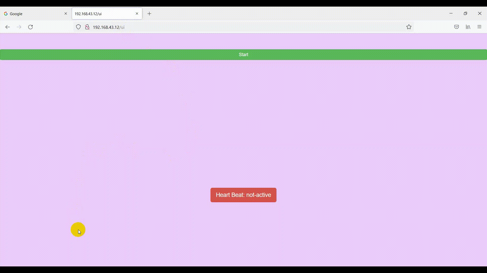

#Instrumentation Project
##Introduction
This project aims to show heartbit and ECG data on a local server in the context of Internet of Things(IoT).
The data is read using an arduino and sends them on local network and the server is implemented on a Raspberry Pi with 2 approaches.
- Thingsboard Platform
- Custom Platform

##Thingsboard Platform
The local [Thingsboard](https://thingsboard.io/) server is implemented on our Raspberry Pi with the ability to show the ECG data.

 

##Custom Platform
Beside the Thingsboard platform a custom monitoring service is also been implemented.

 
